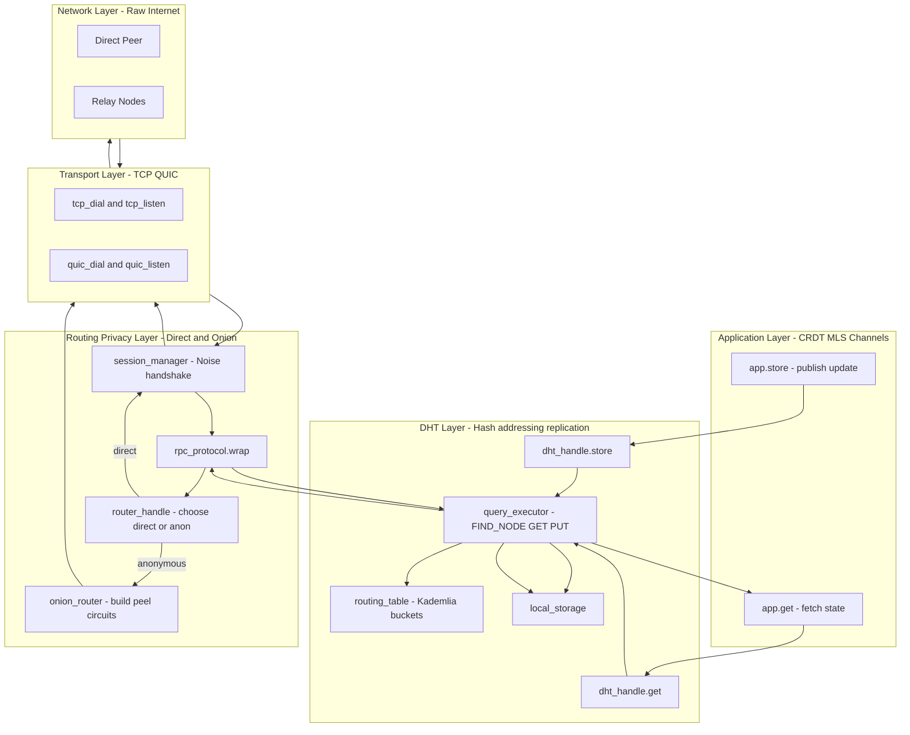

The DHT module

first, it is responsible for content addressing - everything! from channels, messasges, user profiles, crdt ops, snapshots, they are all stored as hashes as keys, no UUID.

second, distributed indexing - nodes collaboratevely maintain a lookup system for :
"Where is entry <hash> stored?"
"Which nodes are closest to <hash> in ID space?"

third, reduntant storage - each piece of data is stored on multiple nodes, to provide availability and fault tolerance.

fourth, self-healing - nodes periodically verify stored data, re-replicate lost pieces, and ensure consistency across replicas.

fifth, efficient lookup - typically O(log N) hops to find data in a network of N nodes, using iterative routing and k-buckets.

six, privacy configurable: can retreive data directly (fast), or anonymously via onion routing (private).

seven, validation layer - reject invalid or malicious data before storing it. check for bad signatures, invalid CRDT ops, identity mismatch, wrong channel ACL, expired messages, etc.

eight, resistance- local node must store: DHT records, routing table, CRDT logs, snapshouts.

Important: this subsystem sits ON TOP of /router and BELLOW of /crdt and /mls.

## Top level stack

```
               ┌───────────────────────────┐
               │        /crdt + /mls       │
               └───────────────┬───────────┘
                               │
                      (uses DHT API)
                               │
                     ┌────────▼────────┐
                     │   /core_dht     │
                     │  (store / get)  │    <- is between app and router>
                     └───────┬─────────┘
                     (DHT RPC messages)
                             │
        ┌────────────────────┴─────────────────────┐
        │                                          │
 ┌──────▼─────────┐                       ┌────────▼────────┐
 │ direct send     │                       │   onion send    │
 │ /router/session │                       │ /router/onion   │
 └──────┬──────────┘                       └────────┬────────┘
        │                                           │
        └─────────────────────┬─────────────────────┘
                              v
                   ┌──────────────────────┐
                   │   TCP / QUIC socket  │
                   └──────────────────────┘
```

## Type of DHT

Kademlia-like DHT with XOR metric, K-buckets, iterative routing, focusing on privacy and data validation.

## Complete data lifecycle Mermaid diagram



## Message flow top to bottom

```
app.store()
   ↓
dht_handle.store()
   ↓
query_executor → routing_table → build dht_message
   ↓
rpc_protocol.wrap(dht_message)
   ↓
router_handle → (direct OR onion)
   ↓
session_manager.encrypt()
   ↓
transport_mgr.send_tcp_or_quic()
   ↓
Raw Internet (direct peer or relay chain)
```

## Message flow bottom to top

```
Raw Internet packet arrives
   ↓
transport_mgr.accept()
   ↓
session_manager.decrypt()
   ↓
rpc_protocol.parse()
   ↓
dht_message → query executor
   ↓
dht_handle → app layer
```
